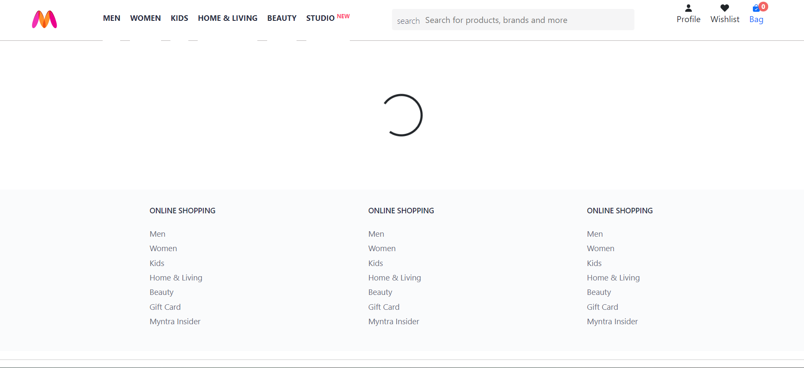
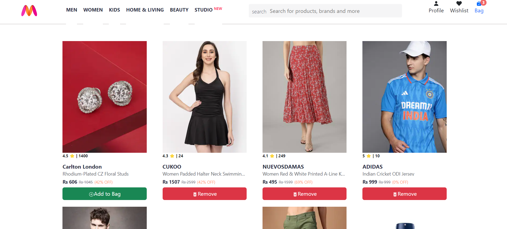
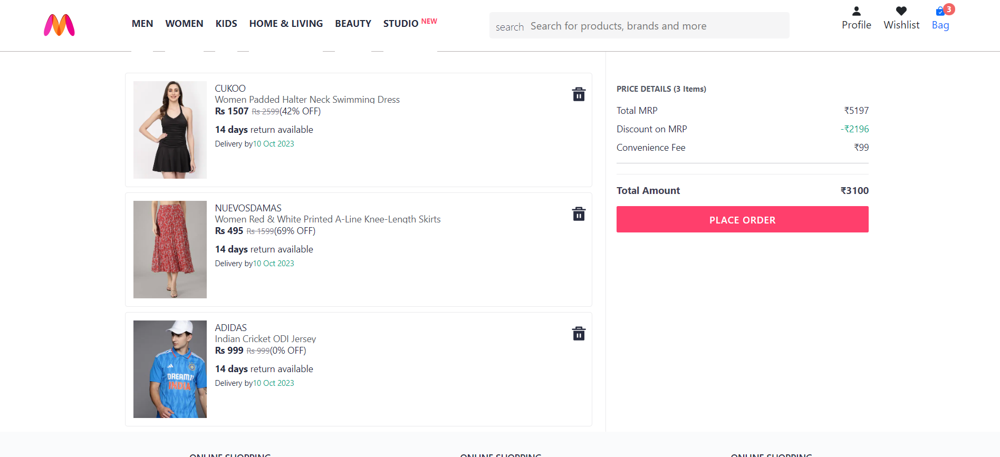
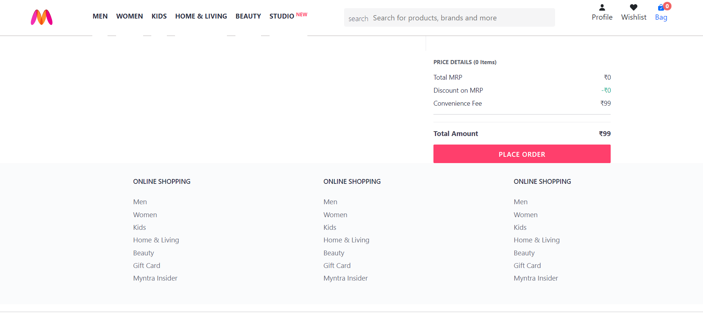

# Myntra Clone 🛍️

This project is a clone of the popular fashion e-commerce platform Myntra, built using React and Redux. It simulates key functionalities of an online shopping website, including browsing products, adding items to the cart, and managing user authentication.

## Features

- Product Listings: Display a wide range of products with detailed information such as price, description, and available sizes.
- Shopping Cart: Add, remove, and update items in the cart with real-time price calculation.
- User Authentication: User login and signup functionality to simulate the shopping experience.
- Product Filters & Sorting: Filter products by category, price, and popularity; sort products for easier navigation.
- Responsive Design: The app is fully responsive and provides a seamless experience across different screen sizes.

## Technical Details:

- React: For building a dynamic user interface and managing component states.
- Redux: For centralized state management, ensuring efficient handling of cart and user data across the app.
- React Router: For seamless navigation between different pages like product listings, cart, and user profile.

- CSS/SCSS: Styled components and responsive design ensure the UI is clean and user-friendly.

## 🚀 About Me

🔭 I’m currently working on My Data Science Skills.
🌱 I’m currently learning Data Analytics, Machine Learning.
💬 Ask me about Front-end Development, React, Python, Databases.

## Run Locally

Clone the project

```bash
  git clone https://github.com/Abhinavv1524/Myntra-Clone.git
```

Go to the project directory

```bash
  cd Myntra-Clone
```

There will be two files one for the backend and other for the main clone i.e

- Actual backend
- Myntra Clone

Go to actual bakcend folder

```bash
  cd Myntra-Clone/Actual-Backend
```

Start the Server

```bash
  npm run start
```

Open a new terminal and go to the myntra clone folder

```bash
  cd Myntra-Clone/Myntra-Clone
```

Install the Node Modules

```bash
  npm install
```

Now run the main file

```bash
  npm run dev
```

## Screenshots








